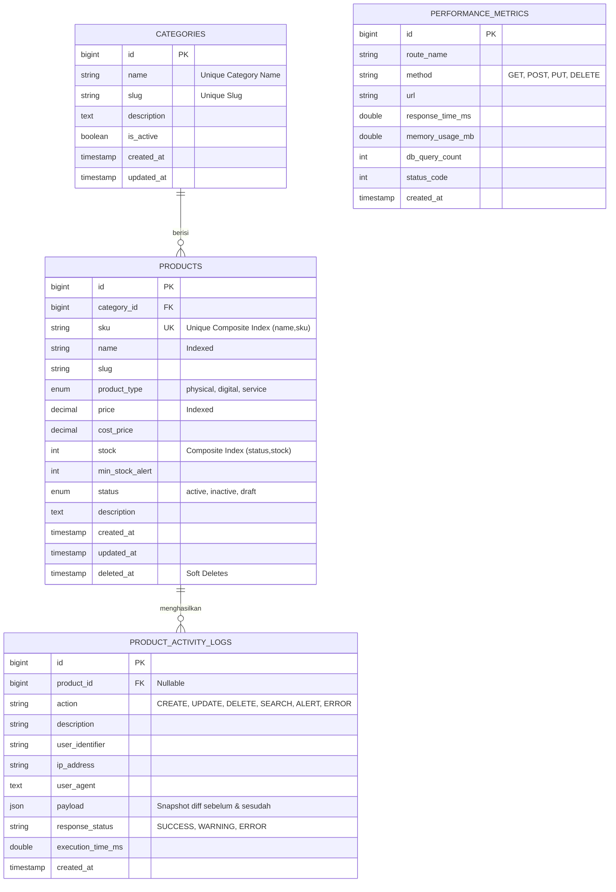

# DOKUMENTASI TEKNIS PERANGKAT LUNAK
## MODUL: PRODUCT MANAGEMENT SERVICE — IT INVENTORY SYSTEM

| Keterangan | Detail |
|:---|:---|
| **Versi Dokumen** | 1.0 |
| **Kategori** | Technical Specification |
| **Platform** | Enterprise Linux / Windows Server |
| **Tanggal Dokumen** | 30 September 2026 |

---

## 1. Ringkasan Eksekutif (Executive Summary)

Modul **Product Management Service** adalah sistem pengelolaan inventaris IT korporat (*IT Inventory Management*) yang dirancang untuk memenuhi kebutuhan kantor perusahaan digital dalam mengelola **aset hardware**, **lisensi software/SaaS**, dan **kontrak layanan IT**. Modul dibangun dengan arsitektur **Layered Service-Repository Pattern** berbasis **Object-Oriented Programming (OOP)** yang memisahkan tanggung jawab secara tegas (*Separation of Concerns*), dilengkapi:

- ✅ Algoritma pencarian multi-kriteria dengan *composable query builder*
- ✅ Validasi berlapis dengan *Form Request Validation*
- ✅ Error handling bertingkat menggunakan *Custom Exception Classes*
- ✅ Audit logging ganda (file + database) melalui Monolog & Eloquent
- ✅ Telemetri performa real-time via *Performance Monitoring Middleware*
- ✅ Antarmuka modal CRUD (Create/Edit/View) tanpa navigasi halaman
- ✅ RESTful API v1 dengan telemetry response headers

---

## 2. Analisis Kebutuhan & Pemilihan Tools (UK J.620100.001.01)

### 2.1 Tech Stack & Justifikasi Pemilihan

| Komponen | Teknologi | Versi | Justifikasi |
|:---|:---|:---|:---|
| **Language Runtime** | PHP | 8.2+ | Typed Properties, Enums, Named Arguments, JIT compiler |
| **Framework** | Laravel | 12.x | IoC Container, Eloquent ORM, Form Requests, Monolog, PHPUnit |
| **Database Engine** | MySQL (InnoDB) | 8.x | ACID compliance, FK constraints, composite index, concurrent I/O |
| **UI Framework** | Bootstrap + Bootstrap Icons | 5.3 | Responsif, komponen modal native, clean corporate aesthetic |
| **Version Control** | Git | 2.50+ | Semantic versioning commit, branch workflow |
| **Testing Suite** | PHPUnit | 11.x | Integration, System (E2E), dan custom Artisan stress benchmark |
| **Server Development** | Laravel Artisan Serve | — | Development server bawaan framework |

### 2.2 Struktur Data & Representasi Memori

| Struktur | Implementasi | Kegunaan |
|:---|:---|:---|
| **Associative Array / Hash Map** | PHP `array` & Laravel `Collection` | Query filter DTO, payload log audit |
| **Relational Table (3NF)** | MySQL InnoDB — `products`, `categories` | Penyimpanan persisten tanpa redundansi data |
| **B-Tree Composite Index** | `(name, sku)` dan `(status, stock)` | Pencarian O(log N) bukan O(N) full table scan |
| **Ordered Event Stream** | `product_activity_logs` timestamp-sorted | Audit trail berurutan secara kronologis |
| **JSON Column** | `payload` di activity log | Menyimpan snapshot diff data sebelum & sesudah perubahan |

---

## 3. Arsitektur Perangkat Lunak (UK J.620100.008.01 & J.620100.010.02)

### 3.1 Diagram Lapisan Arsitektur (Layer Architecture)

```
┌──────────────────────────────────────────────────┐
│              HTTP REQUEST (Browser / API Client)              │
└────────────────────────┬─────────────────────────┘
                         │
┌────────────────────────▼─────────────────────────┐
│           MIDDLEWARE LAYER                        │
│  PerformanceMonitoringMiddleware                  │
│  → Mencatat: Latensi (ms), RAM (MB), Query Count  │
│  → Menyisipkan X-Response-Time-Ms header          │
└────────────────────────┬─────────────────────────┘
                         │
┌────────────────────────▼─────────────────────────┐
│           PRESENTATION LAYER                      │
│  ProductController      → Web UI (Modal CRUD)    │
│  ProductApiController   → REST API v1 JSON       │
│  MonitoringController   → Dashboard Telemetri    │
└────────────────────────┬─────────────────────────┘
                         │
┌────────────────────────▼─────────────────────────┐
│           REQUEST VALIDATION LAYER                │
│  StoreProductRequest   (rules Create)            │
│  UpdateProductRequest  (rules Update)            │
└────────────────────────┬─────────────────────────┘
                         │
┌────────────────────────▼─────────────────────────┐
│           SERVICE LAYER                           │
│  ProductService implements ProductServiceInterface│
│  ├── Business Rules (Unique SKU enforcement)     │
│  ├── DB Transaction (Begin / Commit / Rollback)  │
│  ├── Dual Logging (Monolog file + DB AuditLog)   │
│  ├── Low Stock Alert Detection & Logging         │
│  └── Custom Exception Throwing                   │
└────────────────────────┬─────────────────────────┘
                         │
┌────────────────────────▼─────────────────────────┐
│           REPOSITORY LAYER                        │
│  ProductRepository implements ProductRepositoryInterface│
│  └── Composable Eloquent Scope Filter Queries    │
└────────────────────────┬─────────────────────────┘
                         │
┌────────────────────────▼─────────────────────────┐
│           DATA ACCESS LAYER                       │
│  MySQL 8.x — InnoDB Composite Indexed Tables     │
│  ├── categories                                  │
│  ├── products  (soft deletes)                    │
│  ├── product_activity_logs                       │
│  └── performance_metrics                         │
└──────────────────────────────────────────────────┘
```

### 3.2 Diagram Entitas (ERD)



### 3.3 Peta Routing Aplikasi

| Method | URI | Controller@Method | Fungsi |
|:---|:---|:---|:---|
| `GET` | `/products` | `ProductController@index` | Halaman katalog + filter |
| `POST` | `/products` | `ProductController@store` | Simpan produk baru |
| `PUT` | `/products/{id}` | `ProductController@update` | Perbarui data produk |
| `DELETE` | `/products/{id}` | `ProductController@destroy` | Soft delete produk |
| `GET` | `/monitoring` | `MonitoringController@index` | Dashboard performa telemetri |
| `GET` | `/activity-logs` | `MonitoringController@logs` | Halaman audit trail log |
| `GET` | `/api/v1/products` | `ProductApiController@index` | REST API search & paginate |
| `POST` | `/api/v1/products` | `ProductApiController@store` | REST API create product |
| `GET` | `/api/v1/products/{id}` | `ProductApiController@show` | REST API detail produk |
| `PUT` | `/api/v1/products/{id}` | `ProductApiController@update` | REST API update produk |
| `DELETE` | `/api/v1/products/{id}` | `ProductApiController@destroy` | REST API delete produk |
| `GET` | `/api/v1/products/statistics` | `ProductApiController@statistics` | REST API statistik |
| `GET` | `/api/v1/products/alerts/low-stock` | `ProductApiController@lowStockAlerts` | REST API stok kritis |

---

## 4. Spesifikasi OOP & Design Pattern (UK J.620100.010.02 & J.620100.013.01)

### 4.1 Dependency Inversion Principle (Interface Contracts)

```php
// app/Contracts/ProductRepositoryInterface.php
interface ProductRepositoryInterface {
    public function getAll(array $filters, int $perPage): LengthAwarePaginator;
    public function findById(int $id): ?Product;
    public function findBySku(string $sku): ?Product;
    public function create(array $data): Product;
    public function update(Product $product, array $data): Product;
    public function delete(Product $product): bool;
    public function getLowStockProducts(): Collection;
    public function getStatistics(): array;
}

// app/Contracts/ProductServiceInterface.php
interface ProductServiceInterface {
    public function listProducts(array $filters, int $perPage): LengthAwarePaginator;
    public function getProductById(int $id): Product;
    public function createProduct(array $data): Product;
    public function updateProduct(int $id, array $data): Product;
    public function deleteProduct(int $id): bool;
    public function getLowStockAlerts(): Collection;
    public function getDashboardMetrics(): array;
}
```

**Binding IoC Container** di `AppServiceProvider`:
```php
$this->app->bind(ProductRepositoryInterface::class, ProductRepository::class);
$this->app->bind(ProductServiceInterface::class, ProductService::class);
```

### 4.2 Custom Exception Classes (Error Handling)

| Exception Class | HTTP Code | Kondisi Pemicu |
|:---|:---:|:---|
| `ProductNotFoundException` | 404 | ID atau SKU tidak ditemukan di database |
| `DuplicateSkuException` | 422 | SKU yang diinput sudah terdaftar di produk lain |
| `InsufficientStockException` | 400 | Pengurangan stok melebihi stok tersedia |

Seluruh exception ditangkap terpusat di `bootstrap/app.php` dengan response JSON terstruktur.

---

## 5. Algoritma Pencarian & Filtering (UK J.620100.011.02)

Implementasi melalui **Composable Query Builder** pada `Product::scopeFilter()`:

```php
// Pseudocode alur pencarian
1. IF parameter 'q' ada:
   → WHERE (sku LIKE %q% OR name LIKE %q% OR description LIKE %q%)

2. IF parameter 'category_id' ada:
   → AND WHERE category_id = :category_id

3. IF parameter 'product_type' ada (physical|digital|service):
   → AND WHERE product_type = :type

4. IF parameter 'stock_status' ada:
   → 'in_stock'     : AND WHERE stock > min_stock_alert
   → 'low_stock'    : AND WHERE stock <= min_stock_alert AND stock > 0
   → 'out_of_stock' : AND WHERE stock = 0

5. IF parameter 'sort' ada (whitelist: name, price, stock, created_at, sku):
   → ORDER BY :sort :direction

6. PAGINATE (default: 10 per halaman)
```

**Keamanan SQL Injection:** Parameter `sort` divalidasi terhadap whitelist array sebelum dimasukkan ke query — mencegah injeksi kolom arbitrer.

---

## 6. Spesifikasi RESTful API

| Method | Endpoint | Deskripsi | Response |
|:---|:---|:---|:---|
| `GET` | `/api/v1/products` | Cari & paginasi produk | `200 OK` JSON + pagination |
| `POST` | `/api/v1/products` | Tambah produk baru | `201 Created` |
| `GET` | `/api/v1/products/{id}` | Detail + log produk | `200 OK` (404 jika tak ada) |
| `PUT` | `/api/v1/products/{id}` | Update data produk | `200 OK` |
| `DELETE` | `/api/v1/products/{id}` | Hapus produk (soft) | `200 OK` |
| `GET` | `/api/v1/products/statistics` | Metrik inventaris | `200 OK` |
| `GET` | `/api/v1/products/alerts/low-stock` | Produk stok kritis | `200 OK` |

**Telemetry Response Headers** (disisipkan oleh Middleware):
```
X-Response-Time-Ms : 3.82
X-Memory-Usage-MB  : 22.50
X-Query-Count      : 2
```

---

## 7. Kategori & Jenis Produk IT Kantor

| Kategori | Contoh Produk | Tipe Aset |
|:---|:---|:---|
| **Perangkat Komputasi** | Laptop Workstation, Desktop All-in-One | Hardware Asset |
| **Jaringan & Infrastruktur** | Switch Managed, Router Enterprise, Access Point | Hardware Asset |
| **Layanan Cloud & Lisensi** | Microsoft 365 E3, Adobe Creative Cloud, Zoom Pro | Lisensi / SaaS |
| **Keamanan Informasi** | SSL Certificate, Antivirus Enterprise, VPN License | Lisensi / SaaS |
| **Layanan IT Profesional** | IT Support Contract, Cloud Migration, Security Audit | Layanan IT |
| **Fasilitas & Furnitur Kantor** | Kursi Ergonomis, Standing Desk, Filing Cabinet | Hardware Asset |

**Kode SKU Prefix Enterprise:**
`HW-` (Hardware), `NET-` (Network), `SW-` (Software), `SRV-` (Service), `OFF-` (Office), `SEC-` (Security), `CLW-` (Cloud)
