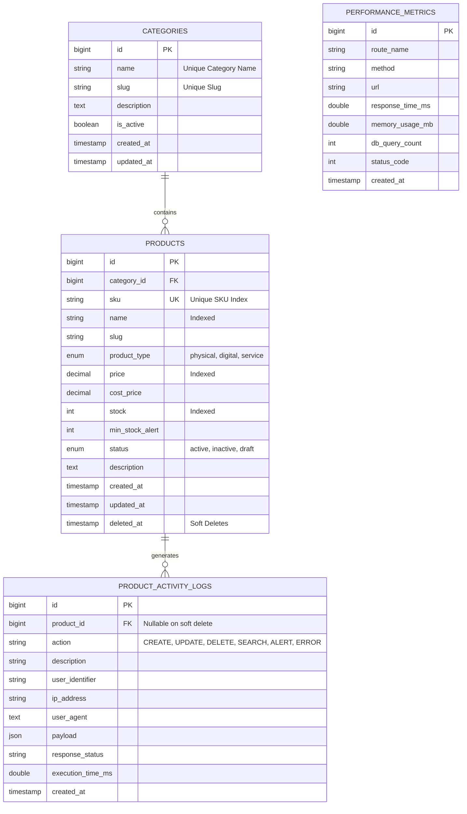

# DOKUMENTASI TEKNIS PERANGKAT LUNAK
## MODUL: PRODUCT MANAGEMENT SERVICE
**Skema Sertifikasi:** Senior Programmer (KKNI Level 6 / Okupasi)  
**Penyelenggara:** LSP / Jobhun  
**Standar Kompetensi Kerja:** SKKNI Kategori Informasi dan Komunikasi Golongan Pokok Aktivitas Pemrograman, Konsultasi Komputer dan Kegiatan yang Berhubungan dengan Itu (J.620100)

---

### 1. Ringkasan Eksekutif (Executive Summary)
Modul **Product Management Service** merupakan layanan internal backend & full-stack yang dirancang untuk mengelola seluruh siklus hidup produk (katalog, status stok, harga, varian, dan tipe produk) di lingkungan sistem digital. Modul ini dibangun dengan arsitektur **Layered Service-Repository Pattern** berbasis Object-Oriented Programming (OOP), dilengkapi kemampuan multi-parameter searching & filtering, validasi berlapis, error handling terstandar, logging audit otomatis, serta telemetri pemantauan performa real-time.

---

### 2. Analisis Kebutuhan & Tools (UK J.620100.001.01 & J.620100.004.02)

#### 2.1 Pemilihan Teknologi & Pustaka (Tech Stack)
| Komponen | Teknologi Terpilih | Versi | Justifikasi Pemilihan |
| :--- | :--- | :--- | :--- |
| **Language Runtime** | PHP | 8.2+ | Mendukung Typed Properties, Enums, Readonly Classes, dan performa JIT compiler tinggi. |
| **Framework** | Laravel | 12.x | Menyediakan IoC Container, Eloquent ORM, migrasi terstruktur, Monolog logger, serta unit testing suite bawaan. |
| **Database Engine** | MySQL (InnoDB) | 8.x | Relational database dengan kepatuhan ACID, foreign key constraints, composite index, dan performa tinggi pada konkurensi I/O. |
| **Styling & UI** | Bootstrap + Icons | 5.3 | Desain responsif, clean aesthetic, standard UX, minim dependensi berat. |
| **Version Control** | Git | 2.50+ | Pelacakan versi kode terstruktur dengan konvensi Semantic Commit. |
| **Testing Suite** | PHPUnit | 11.x | Pengujian integrasi (Integration Test), pengujian sistem (System Test), dan custom artisan benchmarking. |

#### 2.2 Struktur Data & Koleksi (Data Structures)
Struktur data dalam memori dan penyimpanan dirancang secara optimal:
- **Hash Map / Associative Array:** Digunakan untuk query filtering dan DTO (Data Transfer Object).
- **Relational Normalized Tables:** Menjamin normalisasi 3NF untuk integritas data kategori dan produk, menghindari redundansi data.
- **B-Tree Composite Indexes:** Diterapkan pada `(name, sku)` dan `(status, stock)` guna memastikan operasi pencarian beroperasi pada kompleksitas waktu **O(log N)** bukan O(N) full table scan.
- **FIFO Daily File Buffers & In-DB Event Stream:** Struktur antrean log terurut waktu (timestamp-based audit trail).

---

### 3. Arsitektur Perangkat Lunak (UK J.620100.008.01 & J.620100.010.02)

Modul ini memisahkan tanggung jawab (Separation of Concerns) secara tegas menggunakan 4 lapisan utama:

```
[ HTTP Request (Web UI / REST API) ]
                │
                ▼
      [ Middleware Layer ]
   (PerformanceMonitoringMiddleware: Catat Latensi, RAM, Query)
                │
                ▼
     [ Presentation Layer ]
 (ProductController / ProductApiController)
                │
                ▼
     [ Request Validation ]
 (StoreProductRequest / UpdateProductRequest)
                │
                ▼
       [ Service Layer ]
(ProductService implements ProductServiceInterface)
  ├── Business Rules (Unik SKU, Cek Stok Minimum)
  ├── DB Transaction Management (Begin/Commit/Rollback)
  ├── Observability Dual-Logging (Monolog + DB Audit Log)
  └── Custom Exception Triggering
                │
                ▼
      [ Repository Layer ]
(ProductRepository implements ProductRepositoryInterface)
  └── Abstraksi Query Eloquent & Composite Filter Scopes
                │
                ▼
      [ Data Access Layer ]
    (MySQL Database 8.x Tables)
```

#### Diagram Hubungan Entitas (ERD - Entity Relationship Diagram)



---

### 4. Spesifikasi Kelas & Penerapan OOP (UK J.620100.010.02 & J.620100.013.01)

#### 4.1 Dependency Inversion Principle (DIP) & Contracts
- **`ProductRepositoryInterface`** (`app/Contracts/ProductRepositoryInterface.php`):
  Mendefinisikan kontrak fungsi akses data produk: `getAll()`, `findById()`, `findBySku()`, `create()`, `update()`, `delete()`, `getLowStockProducts()`, `getStatistics()`.
- **`ProductServiceInterface`** (`app/Contracts/ProductServiceInterface.php`):
  Mendefinisikan kontrak orkestrator aturan bisnis: `listProducts()`, `getProductById()`, `createProduct()`, `updateProduct()`, `deleteProduct()`, `getLowStockAlerts()`, `getDashboardMetrics()`.
- **Dependency Injection Container:** Terikat di `AppServiceProvider` melalui IoC:
  ```php
  $this->app->bind(ProductRepositoryInterface::class, ProductRepository::class);
  $this->app->bind(ProductServiceInterface::class, ProductService::class);
  ```

#### 4.2 Error Handling & Custom Exceptions (UK J.620100.012.02)
Aplikasi tidak menggunakan generic error string melainkan class exception berorientasi objek yang ditangkap terpusat di `bootstrap/app.php`:
1. **`ProductNotFoundException`** (HTTP 404): Dipicu jika ID atau SKU produk tidak ditemukan.
2. **`DuplicateSkuException`** (HTTP 422): Dipicu jika pengguna mencoba membuat/memperbarui produk dengan SKU yang telah terdaftar.
3. **`InsufficientStockException`** (HTTP 400): Dipicu jika jumlah pengurangan stok melebihi stok yang tersedia.

---

### 5. Algoritma Pencarian & Filtering (UK J.620100.011.02)

Algoritma pencarian dirancang dinamis dengan pendekatan *Composable Query Builder* melalui `Product::scopeFilter()`:
1. **Pencarian Multi-Kolom:** Kata kunci dicocokkan secara fleksibel pada kolom `sku`, `name`, dan `description`.
2. **Kombinasi Filter Deterministik:** Mendukung filter bersamaan berdasarkan `category_id`, `product_type`, `status`, rentang harga (`min_price` - `max_price`), dan kondisi stok (`in_stock`, `low_stock`, `out_of_stock`).
3. **Pengurutan Dinamis Aman:** Mencegah SQL Injection dengan memvalidasi parameter sort terhadap whitelist field (`name`, `price`, `stock`, `created_at`, `sku`).

---

### 6. Spesifikasi RESTful API (Endpoints)

| HTTP Method | URI Endpoint | Deskripsi | Respons Sukses |
| :--- | :--- | :--- | :--- |
| `GET` | `/api/v1/products` | Pencarian & Pagination Produk | `200 OK` (JSON items + meta) |
| `POST` | `/api/v1/products` | Tambah Produk Baru | `201 Created` |
| `GET` | `/api/v1/products/{id}` | Ambil Detail Produk | `200 OK` (atau 404) |
| `PUT` | `/api/v1/products/{id}` | Perbarui Data Produk | `200 OK` |
| `DELETE` | `/api/v1/products/{id}` | Hapus Produk (Soft Delete) | `200 OK` |
| `GET` | `/api/v1/products/statistics`| Rekapitulasi Metrik Inventaris | `200 OK` |
| `GET` | `/api/v1/products/alerts/low-stock` | Daftar Produk Stok Kritis | `200 OK` |

*Setiap respons HTTP menyertakan telemetry header:*
- `X-Response-Time-Ms`: Waktu pemrosesan server dalam milidetik.
- `X-Memory-Usage-MB`: Puncak penggunaan RAM proses PHP.
- `X-Query-Count`: Jumlah query SQL yang dieksekusi.
